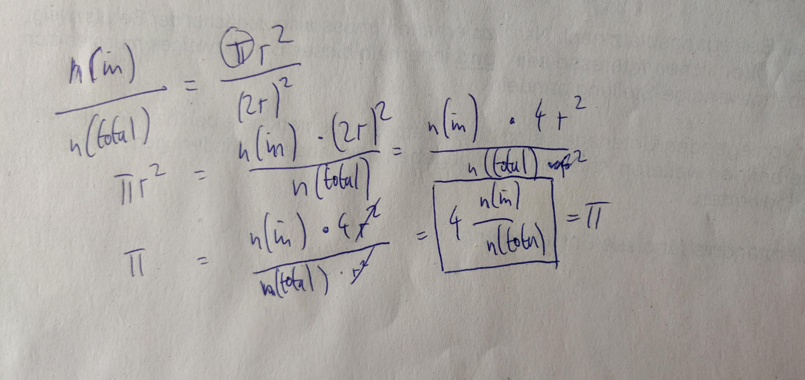

<!-- README.md is generated from README.Rmd. Please edit that file -->

```{r, include = FALSE}
knitr::opts_chunk$set(
  collapse = TRUE,
  comment = "#>"
)
```

# runif_circle

<!-- badges: start -->
<!-- badges: end -->

The goal of runif_circle is to calculate pi just with random numbers.

We generate random numbers and calculate the distance to 0. If the distance is larger r, its outside the circle (red).


```{r}
#!/usr/bin/env Rscript

dist_null <- function(a, b) {
  # a^2+b^2=c^2
  c <- sqrt(a^2 + b^2)
  
  if (c > 1) {
    check <- "outer"
  } else (
    check <- "inner"
  )
  
  return(check)
}

r <- 1
n <- 1000
x <- runif(n)
y <- runif(n)
check <- mapply(dist_null, x, y)

if(n <= 10000){
  plot(x, y, col = as.factor(check))  
}
```

To calculate pi, we set the association between the circle to the square (around the circle) is equal to the number of points within the circle to the number of total points (n).


Just needed to switch the formula to pi:

```{r out.width="40%"}

```

Result of 1000 dots is:

```{r}
# n (in) to n(total) = A(circle) / A(square)
# A(circle) = n * r^2
# A(square) = (2r)^2
num <- length(check[check == "inner"]) * ((2*r)^2)
denum <- length(check)
(pi <- num/denum/r^2)

```

